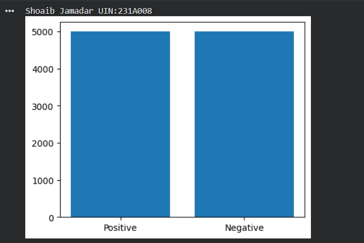
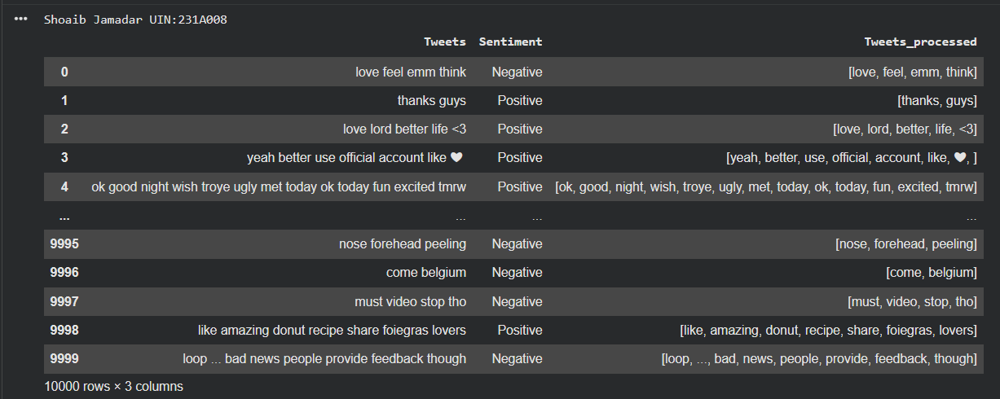
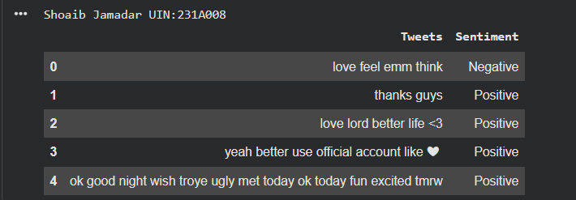

# Experiment 02

## Aim
Apply tokenization and filtration (including script validation) to a chosen text corpus, and analyze the structure of tokenized output.

## Problem Statement
Raw tweet text contains noise such as retweet tags, hyperlinks, hashtags, mentions, and punctuation that must be removed before it can be used in NLP/ML models. This experiment builds a pipeline to clean and normalize tweet text.

## Brief Theory
Text preprocessing is a crucial first step in any NLP pipeline. It typically involves:
- Removing noise (URLs, mentions, hashtags, retweet markers)
- Tokenization (splitting text into words)
- Stopword removal (filtering common words with little semantic value)
- Punctuation removal

These steps reduce dimensionality and noise, improving downstream model performance.

## Implementation Explanation
1. Loaded the `twitter_samples` dataset (positive and negative tweets) from NLTK.
2. Converted tweets into pandas DataFrames and labeled them with `Sentiment` (Positive/Negative).
3. Combined and shuffled the dataset.
4. Visualized class distribution using a bar chart.
5. Selected a sample tweet and demonstrated step-by-step cleaning:
   - Removed "RT" retweet markers
   - Removed hyperlinks
   - Removed hashtag symbols and mentions
   - Removed emoticon-style punctuation
6. Tokenized the cleaned tweet using `TweetTokenizer`.
7. Removed English stopwords and punctuation from the tokens.
8. Wrapped all steps into a reusable function `clean_tweet()`.
9. Applied `clean_tweet()` to the entire dataset and stored results in a new column `Tweets_processed`.

## Results
- Dataset: 5000 positive + 5000 negative tweets (balanced).
- Bar chart confirms equal class distribution.
- Sample tweet successfully cleaned and tokenized, with stopwords/punctuation removed.
- Final dataset contains a cleaned `Tweets` column ready for feature extraction/modeling.

## Conclusion
Successfully implemented an NLP text preprocessing pipeline for tweet sentiment data, covering noise removal, tokenization, and stopword filtering a foundational step before applying sentiment classification models.

## References
- NLTK Documentation: https://www.nltk.org/
- NLTK twitter_samples corpus
